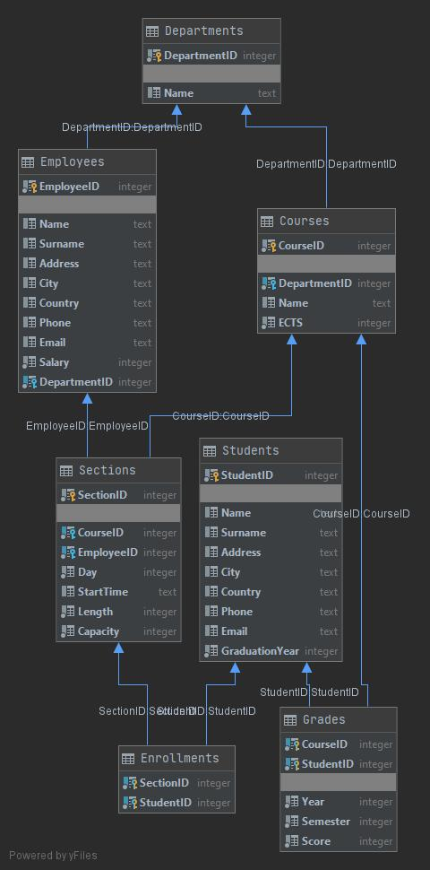

# University Database

## Projekt na laboratoria Bazy Danych.

##### Grupa:
  - Cyra Agata
  - ~~Nowakowski Karol~~ (urlop dziekański)
  - Siwek Patryk

##### Projekt:
  - Temat: Baza danych dla uczelni.
  - Serwer: lokalny serwer SQL
  - Technologie: .Net i Entity Framework
  - Link: https://github.com/kklgf/universityBD

## Current database schema

## Features
- Database schema implementation and creation [Patryk]
- Inteligent adding of new entities from terminal [Patryk]
- Inteligent searching of entities from terminal [Patryk]

