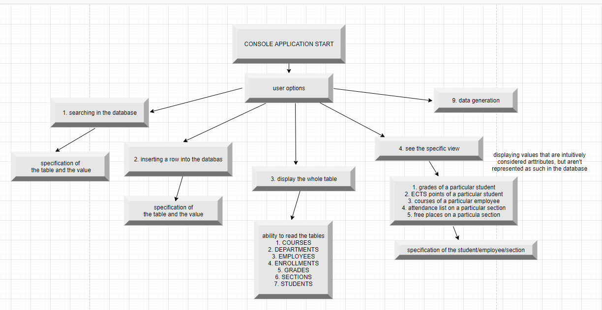

# University Database

## Projekt na laboratoria Bazy Danych.

##### Grupa:
  - Cyra Agata
  - ~~Nowakowski Karol~~ (urlop dziekański)
  - Siwek Patryk

##### Projekt:
  - Temat: Baza danych dla uczelni.
  - Serwer: wykorzystanie SQLite -- baza danych jest zintegrowana z aplikacją, która ma do niej bezpośredni dostęp (serwer nie jest potrzebny)
  - Technologie: .Net i Entity Framework
  - Link: https://github.com/kklgf/universityBD

## Current database schema

## User guide

## Features
- Database schema implementation and creation [Patryk]
- Inteligent adding of new entities from terminal [Patryk]
- Inteligent searching of entities from terminal [Patryk]
- Viewing the grades of a particular student: function Student.StudentGrades(); [Agata]
- Viewing the courses of a particular employee: function Employee.EmployeesCourses(); [Agata]
- Viewing the ECTS points of a particular student: function Student.StudentsECTS(); [Agata]
- Viewing the "attendance list" (list of students during at the particular section): function Section.AttendanceList(); [Agata]
- Viewing free places on a particular section: function Section.FreePlaces(); [Agata]
- Random data generation for whole database [Patryk]

## Data corectness insurance
- blocking student from having two classes at the same time: using the HasClassesAtTheTime(studentID, section) while enrolling for classes
- blocking the course overload (more students than capacity): while adding a new enrollment
- ensuring there is an existing row (in another table) while adding an attribute -- you need to choose from existing

## Dependencies
- Faker.Net:
    dotnet add package Faker.Net --version 1.3.77
- NBuilder:
    dotnet add package NBuilder --version 6.1.0

## Entire code breakdown
### File: Program.cs
#### Class: Program
> class responsible for interaction with user  
> catches the answers and switches appropriate functions depending on what user decides to do
##### static void Main(string[] args)
##### static void Search(UniversityContext database)
##### static void SeeTable(UniversityContext database)
##### static object Add()
##### static void SpecificViews()
##### static void Seed(UniversityContext context)
##### static void WrongAction()

### File: Course.cs
#### Class: Course
> object class being mapped into the database table  
[Key]\
public int CourseID { get; set; }\
[ForeignKey("Department")]\
public int DepartmentID { get; set; }\
public Department Department { get; set; }\
public String Name { get; set; }\
public int ECTS { get; set; }\
##### public static Course NewCourse()
> constructor
##### public static void SeeAll()
> being called from program main function prepares the view of the whole COURSES table in the database
##### public static void print(IQueryable\<Course> query)
> being called from SeeAll() or Search() function displays the result of the query
##### public static void Search()
##### public static Course SearchToAdd()

### File: Department.cs
#### Class: Department --- object class being mapped into the database table
public int DepartmentID { get; set; }\
public String Name { get; set; }\
##### public static Department NewDepartment()
##### public static void SeeAll()
##### public static void print(IQueryable\<Department> query)
##### public static void Search()
##### public static Department SearchToAdd()

### File: Employee.cs
#### Class: Employee --- object class being mapped into the database table
public int EmployeeID { get; set; }\
public String Name { get; set; }\
public String Surname { get; set; }\
public String Address { get; set; }\
public String City { get; set; }\
public String Country { get; set; }\
public String Phone { get; set; }\
public String Email { get; set; }\
public int Salary { get; set; }\
\[ForeignKey("Department")]\
public int DepartmentID { get; set; }\
public Department Department { get; set; }\
##### public static void SeeAll()
##### public static void print(IQueryable\<Employee> query)
##### public static Employee NewEmployee()
##### public static void Search()
##### public static Employee SearchToAdd()
##### public static void EmployeesCourses()

### File: Enrollment.cs
#### Class: Enrollment
\[ForeignKey("Section")]\
public int SectionID { get; set; }\
public Section Section { get; set; }\
\[ForeignKey("Student")]\
public int StudentID { get; set; }\
public Student Student { get; set; }\
##### public static Enrollment NewEnrollment()
##### public static void SeeAll()
##### public static void print(IQueryable\<Enrollment> query)
##### public static void Search()
##### public static Enrollment SearchToAdd()

### File: Grade.cs
#### Class: Grade
\[ForeignKey("Course")]\
public int CourseID { get; set; }\
public Course Course { get; set; }\
\[ForeignKey("Student")]\
public int StudentID { get; set; }\
public Student Student { get; set; }\
public int Year { get; set; }\
public int Semester { get; set; }\
public int Score { get; set; }\
##### public static Grade NewGrade()
##### public static void SeeAll()
##### public static void print(IQueryable\<Grade> query)
##### public static void Search()
##### public static Grade SearchToAdd()

### File: Section.cs
#### Class: Section
public int SectionID { get; set; }\
\[ForeignKey("Course")]\
public int CourseID { get; set; }\
public Course Course { get; set; }\
\[ForeignKey("Employees")]\
public int EmployeeID { get; set; }\
public Employee Employee { get; set; }\
public int Day { get; set; }\
public String StartTime { get; set; }\
public int Length { get; set; }\
public int Capacity { get; set; }\
##### public static Section NewSection()
##### public static void SeeAll()
##### public static void print(IQueryable\<Section> query)
##### public static void Search()
##### public static Section SearchToAdd()
##### public static int CountStudsOnTmpDB(Section section, UniversityContext context)
##### public static int CountStudentsOnSection(Section section)
##### public static void AttendanceList()
##### public static void FreePlaces()

### File: Student.cs
#### Class: Student
public int StudentID { get; set; }\
public String Name { get; set; }\
public String Surname { get; set; }\
public String Address { get; set; }\
public String City { get; set; }\
public String Country { get; set; }\
public String Phone { get; set; }\
public String Email { get; set; }\
public int GraduationYear { get; set; }
##### public static Student NewStudent()
##### public static void Search()
##### public static void print(IQueryable\<Student> query)
##### public static void SeeAll()
##### public static Student SearchToAdd()
##### public static bool HasClassesAtTheTime(int studentID, Section section)
##### public static void StudentsGrades()
##### public static void StudentsECTS()

### File: UniversityContext.cs
#### Class: UniversityContext : DbContext
> class inheritating from DbContext responsible for creating a connection with a database and mapping classes into entities  
public DbSet\<Course> Courses { get; set; }\
public DbSet\<Department> Departments { get; set; }\
public DbSet\<Employee> Employees { get; set; }\
public DbSet\<Enrollment> Enrollments { get; set; }\
public DbSet\<Grade> Grades { get; set; }\
public DbSet\<Section> Sections { get; set; }\
public DbSet\<Student> Students { get; set; }\

### File: DepartmentNames.cs
#### Class: DepartmentNames
> file used for data generation to make department names sound less awkward than the ones generated automatically
##### public static List\<String> GetListOfNames()

### File: WeekDays.cs
#### Class: WeekDays
> class used for parsing numbers stored in the database into the string values like 'Monday' to be displayed for the user
##### public static String Parse(int number)
